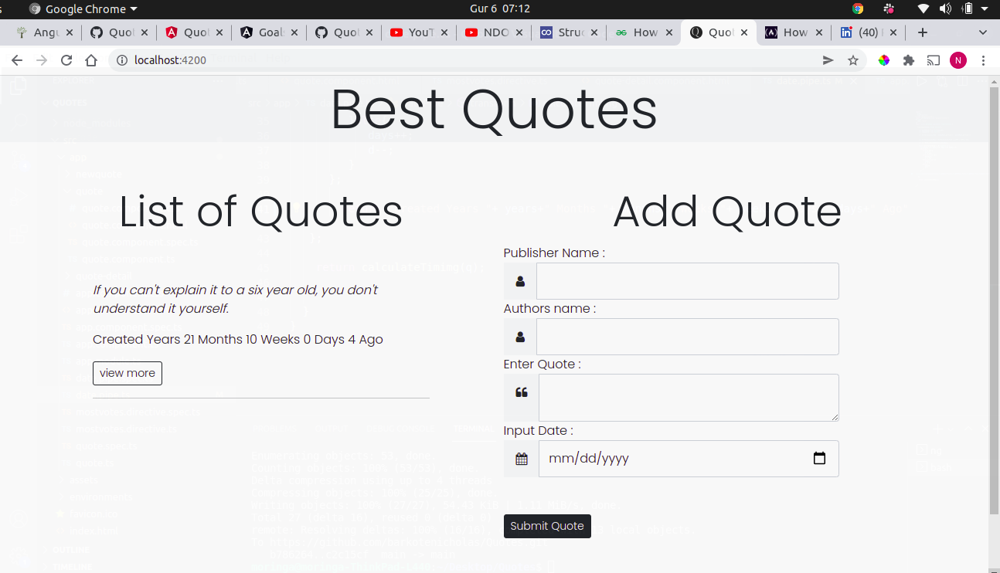

# Quote Application

Quote application is used to add quotes and delete quotes

---
# preview


---

---
**Version1.0.0**

---

---
## Authors
- Nicholas Barkote <nicholas.kebut@student.moringaschool.com>
---

## Requirements

- google Chrome
- git
- nodejs


* Open index.html with a google chrome
 
# Tech Stack

- HTML
- CSS
- bootstrap
- Angular
  

## Setup Instructions

* clone it to your desktop 
```bash
 git clone  https://github.com/barkotenicholas/Quotes.git
 cd Quotes
 npm install
 ng serve -o
 code .
  ```

## Contact Information

<a href="mailto:barkotenicholas@gmail.com">barkotenicholas@gmail.com</a>

 ## Live Link


[Click here to see the website](https://barkotenicholas.github.io/Quotes/)


## License & copyright

© Nicholas k Barkote , Moringa school student

Licensed under the [MIT License](LICENSE)

---

This project was generated with [Angular CLI](https://github.com/angular/angular-cli) version 13.1.4.

## Development server

Run `ng serve` for a dev server. Navigate to `http://localhost:4200/`. The app will automatically reload if you change any of the source files.

## Code scaffolding

Run `ng generate component component-name` to generate a new component. You can also use `ng generate directive|pipe|service|class|guard|interface|enum|module`.

## Build

Run `ng build` to build the project. The build artifacts will be stored in the `dist/` directory.

## Running unit tests

Run `ng test` to execute the unit tests via [Karma](https://karma-runner.github.io).

## Running end-to-end tests

Run `ng e2e` to execute the end-to-end tests via a platform of your choice. To use this command, you need to first add a package that implements end-to-end testing capabilities.

## Further help

To get more help on the Angular CLI use `ng help` or go check out the [Angular CLI Overview and Command Reference](https://angular.io/cli) page.
